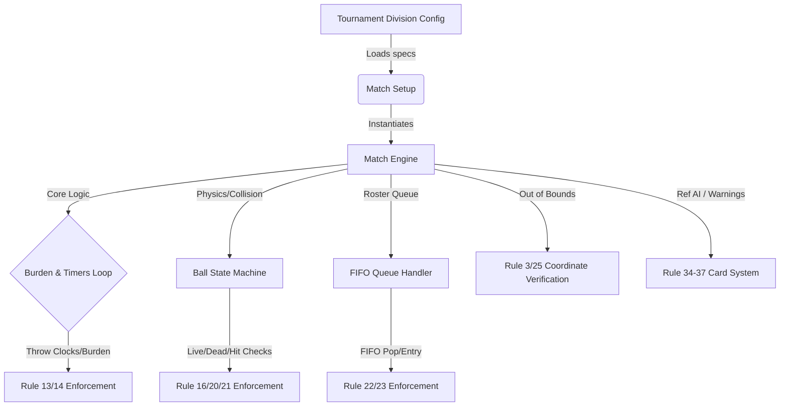

# USA Dodgeball v2026.1 Rulebook Implementation Extraction Matrix
**Dodgeball Simulator Project Documentation**  
**Document Version:** 1.0  
**Target Rulebook:** USA Dodgeball (USAD) Premier Tour Rules & Regulations (Version 2026.1, Published March 7, 2026)

---

## Executive Summary
This document provides a highly detailed, comprehensive, and complete **Implementation Extraction Matrix** for integrating the official **USA Dodgeball v2026.1** ruleset into the *Dodgeball Simulator* game. 

This matrix is designed as a blueprint for developers, game designers, and QA engineers. It meticulously details the game-system, core physics/logic engine, UI/replay rendering, testing, and edge case parameters for all **41 numbered sections** of the rulebook. It does not omit minor clauses, ensuring that the simulation maintains a 100% faithful representation of real-world competitive dodgeball across all main formats (WDBF Foam, WDBF Cloth, and USAD No-Sting Rubber).

---

## Authority & Classification Legend
Each section of the matrix contains a **Classification** indicating its domain scope:
- **Foam/No-Sting-Specific:** Applies exclusively to 6-ball foam or no-sting divisions.
- **Cloth-Specific:** Applies exclusively to 5-ball cloth divisions.
- **Mixed-Division-Specific:** Applies to mixed-gender team rosters and matching rules.
- **Disciplinary:** Covers verbal warnings, blue/yellow/red cards, and ejections.
- **Administrative:** Covers registration, rosters, uniforms, staff, and appeals.
- **Universal:** Standard rules governing core match mechanics, ball states, and court boundaries.

---

## Complete Rulebook Matrix (Sections 1–41)

### 1. Balls
* **Rule Summary:** A game is played with one of three approved ball types: (1) WDBF-approved foam, (2) WDBF-approved cloth, or (3) USAD-approved no-sting rubber. Foam and No-Sting matches are played with six balls of identical color. Cloth matches are played with five balls of identical color.
* **Game-System Implication:** The tournament or division configuration controls which ball type is loaded. Team training, recruitment, and player skills must differentiate between Foam/No-Sting and Cloth proficiency.
* **Engine Implication:** Set core ball physics parameters based on type: 
  * `foam/no-sting`: ball count = 6, mass/drag coefficients mapped to high-velocity, high-damping properties. Burden majority limit = 4.
  * `cloth`: ball count = 5, mass/drag mapped to high-precision, low-damping properties. Burden majority limit = 3.
* **UI/Replay Implication:** Dynamically render 5 or 6 ball models with specific textures (foam foam-texture, cloth fabric-texture, rubber rubber-sheen) during matches and replay theater.
* **Test Scenarios:** 
  * Verify that choosing "Cloth Division" instantiates exactly 5 balls.
  * Verify that choosing "Foam Division" instantiates exactly 6 balls.
* **Edge Cases:** Mid-season rule changes or custom sandbox modes attempting to play Cloth with 6 balls or Foam with 5.
* **Classification:** Foam/No-Sting-specific & Cloth-specific (Mixed).

---

### 2. Apparel and Equipment
* **Rule Summary:** Numbers on front/back are encouraged but not required. Vulgar or hateful content on uniforms is prohibited and can lead to eviction if not removed. Alternate/warm-up uniforms are permitted if distinct from the opponent. Sweatshirts and hoodies are strictly prohibited during play. Referees must not wear the uniform of either team. Required gear: closed-toe athletic shoes with non-marking soles and team uniforms. Permitted gear: knee/elbow pads, braces, arm sleeves, non-rigid athletic hats/sweatbands, prescription contacts, protective eyewear (rec specs), athletic tape (closed adhesive), and hand chalk (must be fully absorbed). Prohibited gear: cleats, raised heels, open-toed shoes, bare feet, helmets, gloves of any kind, tar tape, standard eyeglasses, sweatshirts/hoodies, and transferrable ball substances. Medical exemptions require written approval from tournament staff.
* **Game-System Implication:** Roster customization screens must restrict equipped gear. In-game ref assignment engine checks ref team affinity/uniform index. Medical exemption status flag added to player attributes.
* **Engine Implication:** Cosmetic equipment is non-functional. Illegal equipment triggers pre-match validation failures (e.g. gloves equipped, no athletic shoes) or triggers mid-game administrative warnings/forfeitures if checked during play.
* **UI/Replay Implication:** Prevent rendering prohibited models (helmets, gloves, hoodies) in game. Draw referee models in standard stripes, never matching active team colors. Render hand-chalking pre-match animations.
* **Test Scenarios:** 
  * Verify validation failure when a player attempts to start a match equipped with "Gloves" or "Standard Eyeglasses" without `medical_exemption = True`.
  * Verify that alternate uniforms are forced if team colors conflict.
* **Edge Cases:** A player with an active medical exemption for standard glasses loses their exemption mid-tournament; the system must auto-unequip the glasses and flag an error.
* **Classification:** Administrative & Universal.

---

### 3. Court
* **Rule Summary:** Standard court measures 59 feet by 29.5 feet, surrounded by a minimum 3.25 feet of free space on all sides. Women's Foam and No-Sting competitions use a back line shifted 1 meter (3.25') closer to the center line (shortening the active court). Attack line placement: Foam/No-Sting = 10 feet from center line; Cloth = 18 feet from center line. Cloth features a neutral zone measuring 6.5 feet on each side of the center line (13' total). Ball placement markers: Foam/No-Sting = two center-line markers 10 feet from each sideline; Cloth = center-line markers evenly spaced for 5 balls. Out Queue is a 3.5' x 15' box located 3.5' from the sideline, rear edge aligned with the court's back line, with both queues positioned on the same side of the court.
* **Game-System Implication:** The court layout and dimension assets must change dynamically based on the match division (Men's vs Women's, Foam vs Cloth). Roster layouts during tactics selection must map to the active court boundaries.
* **Engine Implication:** Load custom boundary collision coordinate sets:
  * Standard Court bounds: `X = [-29.5, 29.5]`, `Y = [-14.75, 14.75]`.
  * Women's short-court bounds: `X = [-26.25, 26.25]`.
  * Attack line triggers: `X = 10` (Foam) vs `X = 18` (Cloth).
  * Neutral zone bounds: `X = [-6.5, 6.5]` (Cloth only).
* **UI/Replay Implication:** Correctly render court lines, attack lines, neutral zones, and out queues based on division. Render eliminated players standing sequentially inside the 3.5' x 15' Out Queue box.
* **Test Scenarios:** 
  * Test that player boundary checks trigger "out" at `X = 26.26` in Women's Foam but remain "in" in Men's Foam.
  * Verify that Cloth matches enforce the 13' neutral zone boundary lines.
* **Edge Cases:** Mixed division matches with varying male/female court limits (standardized to the male court unless specific tournament overrides apply).
* **Classification:** Foam/No-Sting-specific & Cloth-specific (Mixed).

---

### 4. Players
* **Rule Summary:** Roster capacity: max 9 players for Open and Women’s divisions, max 10 players for Mixed divisions. Mixed rosters can have a maximum of 5 players of each gender. Match capacity: min 4, max 6 players start. Fewer than 4 players at match start results in a game forfeit. Mixed division starting rules: failure to provide at least 2 players of each gender results in a game forfeit. If a mixed team can only provide 2 players of one gender, they can start with 5 total players, but they cannot play with 4 players of one gender (e.g. 4M/2F is valid, 4M/1F is invalid). Non-starters are inactive and cannot re-enter the game via catches. Substitutions are allowed only between games or in the case of injury. Each team must designate a captain and/or coach for referee communication; non-designated players communicating with refs are subject to a Blue Card. All players must be registered USAD members.
* **Game-System Implication:** Lineup selection screens must enforce gender ratios, active/inactive lists, and captain designations. Registration status is verified during player contract signing or tournament entry.
* **Engine Implication:** Match initializer verifies player counts and gender balances. Set `is_active = False` on non-starters to exclude them from catch-return queue arrays. Track the designated captain/coach ID to handle referee communication checks.
* **UI/Replay Implication:** Lineup builder UI must highlight gender configuration errors. Display captain/coach badges on player cards. Show only active starters in the on-screen queue.
* **Test Scenarios:** 
  * Test that attempting to start a Mixed match with 4 males and 1 female throws a validation error.
  * Test that a non-starter attempting to enter the court after a catch is blocked and flagged.
* **Edge Cases:** An injury to the only remaining female player on a mixed roster in a 2M/2F lineup, forcing a roster default because no female substitutes remain.
* **Classification:** Mixed-division-specific, Administrative, & Universal.

---

### 5. Team Names
* **Rule Summary:** Team names must be appropriate and not derogatory or discriminatory regarding race, color, religion, sex, sexual orientation, gender identity/expression, age, disability, citizenship, or national origin. USAD reserves the right to force changes or decline tournament participation.
* **Game-System Implication:** Procedural name generation and user custom-input filters. System contains a profanity/hate-speech dictionary.
* **Engine Implication:** None (purely administrative/metadata validation).
* **UI/Replay Implication:** Input text validation during team creation or editing, displaying a standard warning if a name is flagged as violating guidelines.
* **Test Scenarios:** 
  * Verify that entering a banned word as a team name displays a rename prompt and blocks submission.
* **Edge Cases:** Accidental offensive word combinations generated by the procedural team-name generator.
* **Classification:** Administrative & Universal.

---

### 6. Match
* **Rule Summary:** Before a match starts (during round robin) or in the playoffs, the higher-seeded team chooses their starting side of the court. A standard round-robin match is 24 minutes long (match clock runs continuously). Late arrival: opposing team is awarded 1 game win per full minute late (max 5). Teams play as many games as possible within the 24 minutes. Timelimits:
  * **Foam/No-Sting:** 3-minute game limit. If a game is unfinished at 3 minutes, it enters "No Blocking" (brief stop, resumes with same players and same ball states). At the end of the 24-minute match clock, the current game stops and resumes as a "No Blocking" game with balls reset to 3 on each side (max 3 minutes; tied if no winner at 3 minutes).
  * **Cloth:** 3-minute game limit. No "No Blocking" mode. If the 3-minute limit is reached, the team with more active players wins the game. Equal players = tie. Wins = 2 points, ties = 1 point, losses = 0 points. Match clock end transitions: if a game ends with 90 seconds to 3 minutes remaining on the match clock, a new game starts with a time limit equal to the remaining match time. If less than 90 seconds remain, one final game with a strict 90-second time limit is played.
  * Teams do not switch sides between games unless directed.
* **Game-System Implication:** Match timers, tournament standing calculations, and late-forfeit game point awards (e.g. 5-0 forfeit).
- **Engine Implication:** Maintain `MatchClock` (24 min) and `GameClock` (3 min) tick loops. 
  * Foam: Trigger `NoBlockingState` at `GameClock >= 180s`. On `MatchClock == 0`, freeze game, execute `reset_balls(3_each)` and set `NoBlockingState = True` with a 180s timer.
  * Cloth: On `GameClock == 180s`, count `live_players` on each side and assign points. On game end, check `MatchClock` remaining time: if `< 90s`, start new game with `GameClockLimit = 90s` and set `MatchClock = 0`.
* **UI/Replay Implication:** Render dual match/game clocks. Display warning banners when transitioning to "No Blocking" (e.g. red court outlines). Show live standings/points (2/1/0 Cloth format) on the HUD.
* **Test Scenarios:** 
  * Test that a Cloth match with 40 seconds left correctly spins up a final 90-second game.
  * Verify that a Foam game exceeding 3 minutes immediately disables ball blocking capabilities.
* **Edge Cases:** The match clock expires exactly at the millisecond a throw is in mid-air (handled by Sequence of Play, Section 18).
* **Classification:** Foam/No-Sting-specific & Cloth-specific (Mixed).

---

### 7. Bracket
* **Rule Summary:** Round-robin ties are broken in order: (1) Total Match Points (Win=3, Tie=1, Loss=0), (2) Total Game Points Scored, (3) Game Points Differential, (4) Head-to-Head Outcome, (5) Coin Flip. Single-elimination brackets are determined by size: >=24 teams = upper bracket of 16; 12-23 teams = upper bracket of 8; <12 teams = single bracket with all teams. Bracket match times: standard rounds = 24 minutes; semifinals = 30 minutes; finals = 40 minutes.
  * **Foam/No-Sting Overtime:** On match clock end, game enters "No Blocking" with balls reset to 3 per side, with no time limit. If still tied after No Blocking, a 3-minute overtime game is played. If still tied at the end of overtime, a final untimed "No Blocking" game is played (balls reset to 3 per side).
  * **Cloth Overtime:** If the match score is tied at the end of the match clock, a 3-minute overtime game is played. If still tied, it enters sudden death (first team to eliminate an opposing player wins the match).
* **Game-System Implication:** Bracket generator and tournament manager modules. Adjusts match duration parameters based on round type (24/30/40 min).
* **Engine Implication:** Implement overtime state machines:
  * Foam: `MatchClock = 0` -> `NoBlocking(untimed)` -> `Overtime(180s)` -> `NoBlocking(untimed)`.
  * Cloth: `MatchClock = 0` -> `Overtime(180s)` -> `SuddenDeath(first_out_wins)`.
* **UI/Replay Implication:** Interactive tournament bracket rendering tree. Dynamic overtime HUD overlays and sudden death indicators.
* **Test Scenarios:** 
  * Verify that a Cloth playoff match tied after the 3-minute overtime immediately awards the match win to the team that secures the very first hit in sudden death.
  * Verify bracket seeding breaks ties correctly using game differential before head-to-head.
* **Edge Cases:** Multiple teams tied across all 4 statistical ranking criteria, forcing a programmatic coin-flip event.
* **Classification:** Foam/No-Sting-specific & Cloth-specific (Mixed).

---

### 8. Ball Placement
* **Rule Summary:** Foam and No-Sting matches place six balls on the center line: three on each side, positioned within the 10' ball placement markers. Players can arrange their team's three balls within their designated markers to their liking during setup. Cloth matches place five balls on center-line markers, evenly spaced across the width of the court.
* **Game-System Implication:** Custom pre-game ball placement tactics screen.
* **Engine Implication:** Initialize starting ball coordinate arrays:
  * Foam: `Ball[0..2]` at `Y = [s sideline, marker]`, `Ball[3..5]` at `Y = [marker, sideline]`, all at `X = 0`.
  * Cloth: `Ball[0..4]` distributed evenly at `X = 0` based on standard spacing formulas.
* **UI/Replay Implication:** Render balls on the center line. In Foam divisions, provide a pre-game interaction allowing players to slide their three balls to custom positions.
* **Test Scenarios:** 
  * Verify that Foam ball coordinates are restricted to their designated half of the center line during pre-game.
  * Verify Cloth ball starting positions are exactly equidistant.
* **Edge Cases:** Players taking too long to place balls (triggers a false start warning/penalty, Section 12).
* **Classification:** Foam/No-Sting-specific & Cloth-specific (Mixed).

---

### 9. Beginning of Play
* **Rule Summary:** Players must start the game with one foot positioned on the back line and the other foot inside the boundary line. The referee follows a strict protocol: (1) call teams to line up, (2) verify both teams are ready by saying "Ready" to each team, and (3) sound the whistle to begin play.
* **Game-System Implication:** Pre-game stance assets and player positioning.
* **Engine Implication:** State transition: `PRE_GAME` -> `OPENING_RUSH`. Validate player coordinates at frame 0: `player.foot_1.y == back_line_y` and `player.foot_2.y` is inbounds. Block player input before the whistle event.
* **UI/Replay Implication:** Whistle sound effect and match-start camera pan. Player models rendered in starting stance (leaning forward, foot on back line).
* **Test Scenarios:** 
  * Verify that players cannot move or initiate actions before `MatchState` changes to `OPENING_RUSH`.
* **Edge Cases:** A player's model glitching across the boundary line at frame 0 (triggering a false start warning, Section 12).
* **Classification:** Universal.

---

### 10. Opening Rush
* **Rule Summary:** Players are out if they step on or over the sidelines during the opening rush. Players may touch or step over the center line to retrieve their designated balls, but they cannot fully cross onto the opponent’s side.
  * **Foam/No-Sting:** Teams may retrieve only the three designated balls on their right.
  * **Cloth:** Teams may retrieve only the two designated balls on their left. The center ball is neutral and available to both teams.
  * **Cloth Center Ball Rules:** Players may not slide or dive to retrieve the center ball. No touching or crossing the center line is allowed. No physical contact is permitted; the offending player is out (incidental contact not penalized). Once the center ball fully crosses the center line, possession belongs to the team that brought it over; opponents must immediately release their grip. Failure to release a contested ball upon established possession can result in a Blue Card if excessive.
  * **General:** A team may retrieve the opponent's inactive balls only after successfully clearing all of their own designated balls. Opponent's balls must be brought behind the attack line to be activated. Interfering with the opponent's inactive balls before clearing one's own results in a ball forfeit: all balls are given to the opponent, players reset to their back lines, and all balls are activated upon referee restart. Balls knocked to the opposite side by the opponent can be activated once the team's own balls are active.
* **Game-System Implication:** AI pathfinding during the opening rush. Aggression strategies (safety first vs aggressive center-ball rush).
* **Engine Implication:** Implement a coordinate detection matrix:
  * Sideline step: if `player.x > sideline_x` during rush -> `player.eliminate()`.
  * Foam center-line check: allow crossover of hands/feet only on the designated right-hand side.
  * Cloth center ball: if `player.velocity` indicates sliding/diving near center ball -> `player.eliminate()`. Detect physical contact vectors between opposing rushers at `X = 0`.
  * Contested grip: if `ball.x > 0` (crossed center line) and `player_B.side == LEFT` and `player_B.is_gripping(ball)` -> start 1.5s timer; if grip not released -> trigger `BlueCard(player_B)`.
  * Forfeit trigger: if `team_A.cleared_balls < team_A.max_balls` and `team_A.touches(team_B.inactive_ball)` -> execute `forfeit_balls_to(team_B)`, `reset_positions()`, and activate all balls.
* **UI/Replay Implication:** Highlight the neutral center ball in Cloth matches. Render contested-ball status on the HUD. Visual indicator for "Cleared" balls.
* **Test Scenarios:** 
  * Test that a Cloth player who slides to get the center ball is immediately called out.
  * Test that touching the opponent's ball before clearing own balls triggers a full reset and ball forfeit.
* **Edge Cases:** Two players grab the center ball in Cloth and pull it back crossing the center line at the exact same millisecond. (Incidental tie-break: ref reset or division of ball).
* **Classification:** Foam/No-Sting-specific & Cloth-specific (Mixed).

---

### 11. Ball Activation
* **Rule Summary:** Players must bring their retrieved balls behind their respective attack line (clear line) to activate them. A ball becomes active the instant it fully crosses the clear line and remains active for the rest of the game. If an inactive ball is thrown: the thrower is out, and the ball remains inactive. Inactive balls can be caught (valid catch that eliminates the thrower and brings in a teammate), but they cannot hit opponents out. The team recovering a thrown inactive ball must bring it behind their own clear line to activate it. A live thrown ball is still live even if the opponent attempts to block it with an inactive ball.
* **Game-System Implication:** Tactics engine must prioritize ball clearing before shooting. AI tactical trees must check ball activation status.
* **Engine Implication:** Track `ball.is_active` boolean.
  * If `ball.thrown` and `ball.is_active == False` -> `thrower.eliminate()`, and set `ball.is_live = False` (hits on opponents are ignored, but catching checks remain active).
  * On ball crossing clear line: `if ball.x > clear_line_x` -> `ball.is_active = True`.
* **UI/Replay Implication:** Visual indicator for inactive balls (e.g. greyed out or translucent). Display "NOT ACTIVATED!" on-screen warning when an invalid throw occurs.
* **Test Scenarios:** 
  * Test that throwing an inactive ball eliminates the thrower and does not eliminate an opponent hit by it.
  * Verify that catching an inactive thrown ball correctly returns the thrower's teammate to play.
* **Edge Cases:** A player clears a ball, but their foot was out of bounds at the moment of clearance (the player is out, and the ball's activation status depends on whether it crossed the line under control before the player became dead).
* **Classification:** Universal.

---

### 12. False Start
* **Rule Summary:** Removing foot contact from the back line before the referee sounds the whistle is a false start. The referee stops play, issues a verbal team warning for the match, and resets the opening rush. A second (and any subsequent) false start by the same team during a match results in that team starting the game with one player out (sent to the queue).
  * **Cloth:** If a team false starts, the teams return to their end lines, and the opposing team is awarded all five balls (which are immediately active when the game starts).
  * Stalling: Intentionally stalling between games, at the referee's discretion, is treated as a false start. Continued stalling results in a Yellow Card.
* **Game-System Implication:** Custom team discipline ratings. Post-game stalling warnings in franchise mode.
* **Engine Implication:** Verify player coordinates before whistle trigger. Maintain a `match_false_start_count` dictionary.
  * Foam: 1st offense = call `reset_rush()`, log warning. 2nd+ offense = trigger `game_start_with_one_out(offending_team)`.
  * Cloth: 1st offense = call `transfer_all_balls(opposing_team)`, bypass opening rush, activate all balls immediately.
* **UI/Replay Implication:** "FALSE START!" overlay screen. Render the penalized player walking to the queue before the game starts. Show ball transfer in Cloth.
* **Test Scenarios:** 
  * Verify that a second false start in Foam starts the game with 5 active players and 1 in the queue.
  * Verify that a Cloth false start awards all 5 balls to the non-offending team.
* **Edge Cases:** Both teams false start at the same moment before the whistle. (Warnings issued to both teams, reset rush, no starting outs applied unless it's a repeat offense for one or both).
* **Classification:** Foam/No-Sting-specific & Cloth-specific (Mixed).

---

### 13. Burden to Throw
* **Rule Summary:** The obligation to throw (burden) prevents stalling. Only active players on the side with burden can relinquish it with a valid throw.
  * **Foam/No-Sting:** Initial burden at match start belongs to the home team (higher seed). The winner of the previous game starts with burden. Burden is established by: (1) majority of balls, (2) majority of players (if balls are equal), and (3) the team that did not have burden last (if players are equal). Every valid throw from either team resets burden.
  * **Cloth:** Established solely by the majority of balls. If balls are equal, officials determine burden based on the nearest player to any reachable dead ball on the court. Burden is relinquished once that side no longer has a majority of balls. If "play [n] balls" is called, burden is relinquished once the team has thrown `n` balls.
* **Game-System Implication:** High-stress game logic. AI tactical behavior shifts (tempo, quick throwing, ball management).
- **Engine Implication:** Calculate burden state after every throw, catch, boundary step, or ball state transition:
  * Foam: `calculate_burden_foam()` checking `ball_count`, `player_count`, and `last_burden_team`.
  * Cloth: `calculate_burden_cloth()` checking `ball_count`. In case of a tie, evaluate Euclidean distance: `min(player.distance(dead_ball))` for both sides to break the tie.
* **UI/Replay Implication:** Display a prominent "BURDEN" visual indicator on the court floor or team HUD. Show the throw clock ticking down for the team holding burden.
* **Test Scenarios:** 
  * Verify that in Foam, when balls are 3-3, the team with 5 players gets burden over the team with 4 players.
  * Verify that in Cloth, when balls are 2-2 with a center dead ball, the team with the closer player is assigned burden.
* **Edge Cases:** A ball is resting exactly on the center line. Proximity check must evaluate all active players on both sides to determine possession and burden.
* **Classification:** Foam/No-Sting-specific & Cloth-specific (Mixed).

---

### 14. Throw Clock
* **Rule Summary:** The throw clock begins the instant burden is established, regardless of whether balls have returned to the court or are held by retrievers. The countdown does not stop unless play is stopped. The throw clock ends when it reaches zero and the ref says "zero". Adding balls to the burden side does not reset the countdown. Throws released before zero must complete their sequence of play. After zero: no new throws are permitted; any ball thrown after zero is awarded to the opponent. Players must allow ongoing sequences to finish (interference = warning or Blue Card).
  * **Foam/No-Sting:** 10-second throw clock, announced by the referee. The last 5 seconds (5 through 0) must be loudly called out. Failure to throw before zero results in forfeiting all balls to the opponent (the referee briefly pauses play to transfer the balls). Clock resets on No Blocking transition.
  * **Cloth:** 10-second throw clock. The team with burden has 5 seconds to clear the majority. If they still hold the majority after 5 seconds, the referee calls "play [n] balls" (where `n` is one less than the balls in possession, max live players). If a throwing motion has clearly begun, the referee delays the call. The team must throw `n` balls within 5 seconds. Failure to do so results in: (a) all players in control of a ball who failed to throw are called out, (b) additional players are called out (nominated by the captain/coach, or selected by refs if they stall) to meet the `n` requirement. The total number of players called out cannot exceed the unthrown balls in possession. If a player in control of a ball is eliminated before throwing, their ball is considered thrown for the `n` requirement.
* **Game-System Implication:** Core pacing loop. AI pathing and throwing prioritization under time pressure. Roster discipline ratings affect selection speed when nominating players to be out.
* **Engine Implication:** 
  * Foam: Start `ThrowClock` at 10s. If it reaches 0s -> trigger `pause_play()`, transfer all balls to the opponent, and reset `ThrowClock`.
  * Cloth: Start `ThrowClock` at 10s. At 5s, if majority still held -> count `balls_in_possession`, calculate `n = min(balls_in_possession - 1, live_players)`. Monitor hand velocity vectors for throwing motions; if `throwing_motion_detected == True`, delay `play_n_balls` until motion ends. Start a 5-second sub-timer. If throws made < `n` at 0s -> eliminate ball holders who didn't throw, then prompt captain for remaining outs up to `n`.
* **UI/Replay Implication:** Visual countdown clock on the HUD. Render the "PLAY N BALLS" warning banner with a counter (e.g., "Throws: 1/2"). Render referee hand signals for cards or transfers.
* **Test Scenarios:** 
  * Test that in Foam, letting the 10-second clock expire successfully pauses play and awards all balls to the opponent.
  * Test that in Cloth, failing to meet the "play [n] balls" requirement eliminates the ball holders who refused to throw.
* **Edge Cases:** A player releases a throw at 0.1s on the clock, but is hit and eliminated at 0.0s before the ball crosses the center line. (The throw is valid as it was released before zero, and the sequence must resolve).
* **Classification:** Foam/No-Sting-specific & Cloth-specific (Mixed).

---

### 15. Stoppage of Play
* **Rule Summary:** The referee should stop play when no live balls are in flight and no players are actively engaged in throwing, blocking, dodging, or catching. Referees can delay timing actions to avoid interrupting active play or stop play immediately to prevent errors. Pausing the game pauses the throw clock, which restarts exactly where it was paused (exception: if paused at 4 seconds or less, it resets to 5 seconds upon resume).
  * **Cloth:** If paused during "play [n] balls", the throw clock resumes at 5 seconds and the "play [n] balls" requirement remains in effect.
  * Balls crossing the center line during a stoppage are returned to the originating side. Referees may overturn calls. No timeouts are allowed during round-robin play.
  * **Playoff Timeouts:** Each team gets 1 timeout per standard bracket match, and 2 timeouts per semifinal/final match. Timeouts last up to 2 minutes, during which all match and game clocks stop. Timeouts can be requested only between games or during a stoppage of play.
* **Game-System Implication:** Timeout management screen and strategic adjustments during playoffs.
* **Engine Implication:** Pause game loops, timer ticks, and physics updates. Upon resume: 
  * If `ThrowClock.time <= 4.0s` -> set `ThrowClock.time = 5.0s`.
  * If Cloth and `play_n_balls_active == True` -> set `ThrowClock.time = 5.0s`.
  * Track remaining timeouts: `team.timeouts -= 1`.
* **UI/Replay Implication:** Dim the screen and display a "TIMEOUT" overlay with a 120-second countdown. Freeze all player animations and ball physics during stoppage.
* **Test Scenarios:** 
  * Verify that pausing the game with 2 seconds left on the throw clock correctly resets it to 5 seconds upon resuming.
  * Verify that timeouts cannot be called while a ball is in mid-flight.
* **Edge Cases:** A team requests a timeout exactly as the 3-minute game clock hits 0. (The timeout is denied as the game has ended, transitioning to post-game or overtime).
* **Classification:** Foam/No-Sting-specific & Cloth-specific (Mixed).

---

### 16. Ball States
* **Rule Summary:** 
  * **Live Ball:** An activated ball thrown by an active player that remains live until it becomes dead. A throw must completely leave the player's hand. (Cloth exception: a ball that is blocked or ricocheted from one side of the court to the other also remains a live ball). A ball remains live until it is deemed dead, regardless of whether the throwing player is subsequently eliminated.
  * **Dead Ball:** A live thrown ball that touches a surface, a dead object, or collides with an opposing live thrown ball in mid-air. Dead objects include: the floor, walls, nets/barriers, referees, spectators, same-side teammates, out players, inactive players, or another dead ball.
  * **Popped Balls:** Considered dead immediately. The referee stops play, replaces the ball, and negates any plays involving the popped ball (play resets to before the throw). The replacement ball is awarded to the team that had possession or whose side it was on.
  * **Contaminated Balls:** Any ball containing blood or other substances is dead immediately. The referee stops play, replaces the ball, and awards it to the team that had possession. Players must immediately check and wash. Placing balls inside jerseys is prohibited.
* **Game-System Implication:** Procedural ball damage/popping event triggers. Medical/blood check sequences.
* **Engine Implication:** Implement a ball state machine: `INACTIVE`, `ACTIVE`, `LIVE`, `DEAD`. 
  * Collision engine maps:
    * `ball` + `floor/wall/net` -> `ball.state = DEAD`.
    * `ball` + `ref/spectator/out_player` -> `ball.state = DEAD`.
    * `ball` + `same_side_teammate` -> `ball.state = DEAD` (teammate is safe).
    * `live_ball_A` + `live_ball_B` (opposing sides) -> both set to `DEAD`.
  * Popped/Contaminated ball: Save game state frame buffers; call `rollback_state(pre_throw_frame)` upon pop detection.
* **UI/Replay Implication:** Sound effect and visual particle spark for ball collisions. Render deflated/split models for popped balls. Render blood indicators for contaminated balls.
* **Test Scenarios:** 
  * Verify that a live ball hitting a referee becomes dead instantly and cannot eliminate a player it hits afterwards.
  * Verify that a popped ball triggers a state rollback to the frame before the throw was released.
* **Edge Cases:** A thrown ball is popped by a sharp object on the wall mid-air before hitting an opponent. (Play is negated, the ball is replaced, and the throw is replayed).
* **Classification:** Mixed (Cloth-specific live blockbacks vs Universal ball state rules).

---

### 17. Throwing
* **Rule Summary:** 
  * **Valid Throw:** An attempt to hit an opposing player out. The live thrown ball must land or pass within 3 feet of an opponent or their position at the moment of release. Valid throws include: two-handed, underhand, side-arm, chest-passes, throwing multiple balls at once, and throwing at a ricocheted ball to prevent a catch. (Cloth exception: blockbacks and blocking attacks are valid throws, as are balls that ricochet off an opponent back into the throwing team's court).
  * **Invalid Throw:** A live thrown ball entering the opponent’s side that passes more than 3 feet away from any opponent or their release-point position. Invalid throws do not relieve burden. The first invalid throw of a match results in a verbal team warning; subsequent instances by the same team result in the thrower being called out.
  * Spiking, slapping, punching, or kicking a ball is invalid; the ball is immediately dead. Throwing during a stoppage of play is invalid.
* **Game-System Implication:** Custom throwing style attributes for players. AI accuracy ratings.
* **Engine Implication:** 
  * Distance check: on ball crossing the center line, calculate the shortest 3D distance between the ball's trajectory vector and all active opponents. If `min_distance > 3.0'`, flag the throw as invalid.
  * If `throw.is_invalid == True` -> do not reset burden. Track team invalid throw count: 1st = warning, 2nd+ = call `player.eliminate()`.
  * If player action is spike/slap/kick -> force `ball.state = DEAD` and flag throw as invalid.
* **UI/Replay Implication:** Highlight ball trajectory in the replay analyzer (green for valid, red for invalid). Display "INVALID THROW" popup text.
* **Test Scenarios:** 
  * Verify that a throw passing 5 feet away from the nearest opponent does not relieve burden and triggers a team warning.
  * Verify that a second invalid throw by the same team results in the thrower being called out.
* **Edge Cases:** A player throws a ball that passes within 2 feet of a player who has already stepped out of bounds but is not yet off the court. (Valid throw, as the target was an active player position).
* **Classification:** Mixed (Cloth-specific blockbacks vs Universal invalid throw rules).

---

### 18. Sequence of Play
* **Rule Summary:** A sequence of play begins with a live, valid throw and is completed when the ball becomes dead or is caught, determined by referee discretion. A live thrown ball in mid-air when the game or match clock expires must complete its sequence of play (it can still hit opponents out or be caught).
* **Game-System Implication:** High-tension final seconds. Play resolution logic.
* **Engine Implication:** If `GameClock >= limit` or `MatchClock == 0`, check if any ball state is `LIVE`. If `live_ball_exists == True`, delay match/game termination until `all_balls.state == DEAD`.
* **UI/Replay Implication:** Render "SEQUENCE ACTIVE" HUD alert. Replay theater slows down time during final sequence resolution.
* **Test Scenarios:** 
  * Verify that a ball thrown at 2 minutes 59.9 seconds that hits an opponent at 3 minutes 0.5 seconds successfully eliminates the opponent before the game ends.
* **Edge Cases:** A buzzer-beater throw hits an opponent, ricochets, and is caught by a teammate after the clock expires. (The catch is valid, the thrower is out, and the hit player is saved, all resolving after the buzzer).
* **Classification:** Universal.

---

### 19. Ball Collision
* **Rule Summary:** Ball collision occurs when multiple balls collide in-flight before contacting any other object or player. If a player’s live thrown ball and an opponent’s live thrown ball collide in mid-air, both balls are dead immediately. If live thrown balls from the same team collide, they remain live until they become dead or are caught (ricochets remain live). If a player executes a controlled drop of a live/active ball from their possession and it is hit mid-air by an opponent's live throw, both balls are dead immediately.
* **Game-System Implication:** Anti-projectile defensive tactics. Skilled throwing counters.
* **Engine Implication:** Detect overlap collisions between two ball colliders.
  * If `ball_A.owner_team != ball_B.owner_team` -> set `ball_A.state = DEAD`, `ball_B.state = DEAD`.
  * If `ball_A.owner_team == ball_B.owner_team` -> maintain `LIVE` state.
  * Controlled drop: If `ball_A` is dropped (possession released within < 0.5s) and collides with `ball_B` (opponent live throw) -> set both to `DEAD`.
* **UI/Replay Implication:** Particle sparks and physical bounce vectors rendered at the point of ball collision. Collision sound effect.
* **Test Scenarios:** 
  * Verify that two opposing throws colliding in mid-air are neutralized and cannot eliminate players on subsequent contact.
* **Edge Cases:** Three balls collide simultaneously (two opposing throws and one same-team throw). (The opposing throws neutralize each other; the same-team throw's status depends on which specific ball it contacted first).
* **Classification:** Universal.

---

### 20. Hitting
* **Rule Summary:** A live player is out when a live thrown ball hits them on any part of their body, hair, clothing, or accessories, and then becomes dead. Once out, they are an exiting player and must immediately head to the queue with a hand raised.
  * **Single Ball Contact:** Opponent is out once the ball becomes dead. Deflecting a live ball into own body or a teammate with a blocking ball results in an out once the ball is dead. A single live ball can eliminate multiple opponents via ricochets. Hitting an opponent's blocking ball and forcing them to drop it results in an out once the dropped ball becomes dead. Dual hits: if players hit each other simultaneously, both are out once the balls become dead. Traps: A trap (ball hitting player and floor simultaneously) is an out. Headshots: Hitting an opponent's head is an out once the ball becomes dead. A hit player can continue to make valid actions (dodges, throws) until the ball that hit them actually becomes dead. Dead players intentionally making plays are penalized (warning or Blue Card).
  * **Multiple Ball Contact:** Player A hit by Ball 1 (ricochets) remains live and can make plays until Ball 1 is dead. If Player A is hit by Ball 2 (which becomes dead) while Ball 1 is still in sequence, Player A is out. Player A is now inactive and cannot play Ball 1. A teammate can still catch Ball 1 (valid catch), but Player A cannot be saved because they were already eliminated by Ball 2. If Player A or a teammate catches Ball 1 after Player A catches Ball 2, both catches are valid. If Ball 1 ricochets from A to B, but Player A catches Ball 2 before Ball 1 is dead: Ball 2 is a valid catch (its thrower is out), but Players A and B are both out once Ball 1 becomes dead.
  * **Proximity Limit:** If a ricocheted ball leaves the court and no play can be made, the sequence ends and the hit player is out immediately.
  * **Cloth Exceptions:** Fingers and hands are considered part of the ball and are exempt from being hit. A live ball hitting an opponent and ricocheting back to the throwing team remains live and can eliminate throwing-team players. A ricochet crossing the center line remains live and completes its sequence.
* **Game-System Implication:** Core combat mechanics. Roster queue management. Hit box configurations (body vs fingers in Cloth).
* **Engine Implication:** 
  * Collision detection: track `player.is_hit_pending` and associate the specific `ball` ID. Allow the player to continue executing actions. Upon `ball.state == DEAD`, trigger `player.eliminate()`.
  * Multi-hit ricochet: propagate the live ball status across multiple collision events: `hit(player_A)` -> `ricochet` -> `hit(player_B)` -> `floor` (both out).
  * Cloth fingers: if collision bone is `finger/hand` and `player.is_holding_ball == True` -> ignore hit.
  * Multiple ball state evaluation: track overlap sequences and enforce queue-saving blocks on a per-ball-sequence basis.
* **UI/Replay Implication:** Flash hit players in red. Animate the exiting player walking to the queue with their hand raised. Display detailed logs of multiple ball resolutions in the replay feed.
* **Test Scenarios:** 
  * Test that in Cloth, a ball hitting a player's fingers while they hold a blocking ball is ruled safe.
  * Test that a player hit by Ball 1 can throw Ball 3 and secure an out before Ball 1 hits the floor and eliminates them.
* **Edge Cases:** A ball ricochets off a player, lands on a referee's shoulder (dead object, ball dead, player out), and is then caught by a teammate (catch invalid).
* **Classification:** Mixed (Cloth-specific finger exemptions, center-line crossover, and throw-side ricochets vs Foam standard hit rules).

---

### 21. Blocking
* **Rule Summary:** A player may use a held ball to block a live thrown ball. The blocked ball remains live until its sequence ends. If a block causes the blocking ball to be dropped, the blocker is out once the dropped ball becomes dead (hits the floor, a player, or a dead object). The blocker is safe if they regain control of the dropped ball before it becomes dead. Teammates hit by a dropped blocking ball are safe; teammates cannot catch a dropped blocking ball to save the blocker. A ball held between a player's legs is eligible to block, but can also be knocked out of possession, causing an out. Fingers and hands holding the ball are not protected (out if hit).
  * **Cloth Exceptions:** Fingers and hands are protected as part of the ball. A blocked ball that ricochets back to the throwing team remains live and can eliminate throwing-team players.
* **Game-System Implication:** Blocking mechanics and block stability ratings.
- **Engine Implication:** 
  * If `ball_A` (live throw) collides with `ball_B` (held by player) -> trigger block physics impact. Calculate grip stability check: if it fails, set `ball_B.is_dropped = True`.
  * Track `ball_B` coordinates: if it collides with `floor` before `player` regains grip -> `player.eliminate()`. Block teammate catch overrides on `ball_B`.
  * Cloth finger check: ignore finger collisions during blocking.
* **UI/Replay Implication:** Spark particle effect at the blocking impact point. Dropping/fumbling animations when a block is dropped.
* **Test Scenarios:** 
  * Verify that a player who blocks, fumbles their ball, but catches it before it hits the ground is ruled safe.
  * Verify that in Foam, hitting the fingers of a player holding a ball rules them out.
* **Edge Cases:** A blocked ball ricochets, hits the blocker's teammate in the chest, and is then caught by another teammate. (The teammate is safe because a blocked ball is live; the catch is valid, and the thrower is out).
* **Classification:** Mixed (Cloth-specific finger protection and throw-side ricochet rules vs Foam standard blocking).

---

### 22. Catching
* **Rule Summary:** 
  * **Valid Catch:** Catching a live ball from the opponent. The thrower is out (exiting player), and the first teammate in the queue enters (entering player). The catcher must demonstrate complete control and have at least one point of contact inbounds to complete the catch. Catching a ball between the legs is valid. No using jerseys as nets (invalid, catcher is out).
  * **Scenarios:**
    * Hit + Catch: Ball hits Player A, ricochets, and is caught by teammate = catch is valid, Player A is safe. (Cloth exception: Player A is NOT safe; Player A is out, but the thrower is still out and a teammate enters).
    * Teammate catches a ricochet after the hit player steps out of bounds = catch is valid (the hit player is out for stepping out of bounds but can re-enter per ref discretion if unaware).
    * Simultaneous multiple catches = valid (multiple throwers out, corresponding number of entries).
    * Mutual simultaneous catches = both valid. If one player demonstrates control before the other, the faster control wins (other is out).
    * Hit + Throwing Team Catch: Ball hits opponent, ricochets, and is caught by a player on the throwing team = catch is invalid, opponent is out. (Cloth exception: the catch is valid, and the opponent is out).
    * Blocked Catch: Opponent blocks a live ball, it ricochets, and is caught by the blocker or their teammate = catch is valid. Blocker may intentionally drop their blocking ball to catch the ricocheted ball. (Cloth exception: if the throwing team catches the blocked ricochet, the catch is valid and the blocker is out).
    * Tipper out of bounds: Active players can jump and tip a ball to a teammate for a catch. If the tipping player lands out of bounds before or after the catch, they are out and cannot be returned by that catch.
    * Hit + Out of Bounds: Hit player falls out of bounds = out, cannot be saved by a catch, ball remains live for teammates to catch.
    * Hit by Ball 1, then Ball 2 = out when Ball 1 sequence ends; catching Ball 2 is invalid.
    * Momentum out of bounds: Completing a catch inbounds, then momentum carries the player out of bounds = catch is valid, but the catcher is out.
    * Buzzer Catch: A valid catch completed after the clock expires still results in the thrower being out and a teammate returning.
* **Game-System Implication:** High-skill catch ratings. Catch mechanics. FIFO queue updates.
* **Engine Implication:** 
  * Catch validation logic: verify `ball.state == LIVE`, `player.is_inbounds == True`, and `player.has_control == True` (evaluated via contact frame duration and velocity stability).
  * Trigger queue pop: `returning_player = team.queue.pop(0)`.
  * Foam vs Cloth ricochet catch outcomes:
    * Foam: `ricochet_catch` -> `hit_player.status = SAFE`, `thrower.eliminate()`.
    * Cloth: `ricochet_catch` -> `hit_player.eliminate()`, `thrower.eliminate()`, execute `queue.pop()`.
* **UI/Replay Implication:** Gold flash effect on a valid catch. Render the returning player running onto the court from the back line. Replay highlights tagged with "Spectacular Catch" or "Tip Save".
* **Test Scenarios:** 
  * Test that in Foam, a teammate catching a ball that hit Player A in the head saves Player A and eliminates the thrower.
  * Test that in Cloth, the same catch eliminates Player A, eliminates the thrower, and brings in the first player from the queue.
* **Edge Cases:** A player catches a ball, and their momentum carries them out of bounds, but they throw the ball to a teammate before stepping out. (The catch is valid, the thrower is out, and the catcher is out upon stepping out).
* **Classification:** Mixed (highly variable Foam vs Cloth ricochet/block catch rules).

---

### 23. Player Entry
* **Rule Summary:** A valid catch returns one teammate to the court as an entering player, strictly in the order they were eliminated (FIFO queue). Entering out of order results in the player being sent to the back of the queue, and the catch entry is wasted. If the first player in the queue enters in error, the team receives a verbal warning (if it causes interference, a Blue Card is issued). An entering player has 5 seconds to enter the court; failure to do so results in them being denied entry and sent to the back of the queue. Players must re-enter along the back line. The entering player becomes live the instant they establish one point of contact inside the court. Only the starting players for a game are eligible to re-enter. If a catch is completed before the entering player reaches the queue, they may touch the queue and re-enter immediately. A player cannot become an entering player on the same sequence of play in which they were eliminated.
* **Game-System Implication:** Player entry animations. FIFO queue tracking on the HUD.
* **Engine Implication:** 
  * Maintain the `team.queue` array. On a catch: fetch `entering_player = team.queue[0]`.
  * Start a 5-second `EntryTimer`. Check `player.position` coordinates: if `player.position.y` crosses `back_line_y` before 5s -> set `player.is_live = True` and stop timer. If timer hits 5s without entry -> move `entering_player` to the end of `team.queue`.
  * Validate that the entering player was part of the starting lineup array.
* **UI/Replay Implication:** Display a 5-second countdown timer above the entering player. Render the player running from the queue box onto the court.
* **Test Scenarios:** 
  * Verify that a player entering out of order is immediately sent to the back of the queue and no player enters the court.
  * Verify that an entering player who takes 6 seconds to step on the court is denied entry and sent to the back.
* **Edge Cases:** A team has only 1 player left on court; they secure a catch and are hit out 0.1 seconds later before the entering player can step on court. (The game continues because the catch was completed, placing an entering player in "entering" state, preventing immediate defeat).
* **Classification:** Universal & Administrative.

---

### 24. Ball Retrieval
* **Rule Summary:** Active players may not leave the court at any time to retrieve a ball.
  * **Designated Ball Retrievers:** Each team can designate a maximum of three ball retrievers per match (must be inactive roster players, communicated to refs before the match, can be switched between games). Retrievers must retrieve only on their team's half of the court and cannot cross or reach over the extended center line. Retrievers cannot enter the court to deliver a ball. Retrieved balls can be held on the sidelines by retrievers (burden remains active).
  * **Cloth Exception:** Retrieved balls must be put back into play between the attack line and the back line.
  * **General:** Non-designated retrievers interfering with a stray ball to manipulate the game forfeit that ball to the opponent. Balls are retrieved only once they are completely out of bounds (any ball on the boundary line is inside the court). A retriever touching a court ball or a non-retriever attempting to retrieve a ball forfeits it to the opponent. Active players can reach over any line to retrieve a ball without touching out of bounds or the opponent's zone. Retrievers are prohibited from fighting active players for stray balls (active players always win possession; retrievers fighting for a ball forfeit it to the opponent, with a Blue Card if excessive). Balls retrieved must go to the team on the side of the center line where the ball was picked up (accidental delivery to the opponent stays with the opponent). Balls cannot be held in the queue. Entering players cannot touch a ball before establishing active court status (forfeit ball, player is out).
* **Game-System Implication:** Retriever assignment UI during pre-match setup.
* **Engine Implication:** 
  * Monitor retriever positions: if `retriever.x` crosses the center line or steps inside the court boundary -> trigger ball forfeit.
  * Verify ball boundaries: a ball is retrievable only if `ball.x > court_sideline_x`. If touched while on the line -> trigger forfeit.
  * Cloth: verify that retrieved balls are placed back on the court within the coordinates behind the 18' attack line.
  * Entering player: if `player.is_entering == True` and `player.touches(ball)` -> `player.eliminate()`, and `forfeit_ball()`.
* **UI/Replay Implication:** Render designated retrievers standing on the sidelines. Animate retrievers running to collect out-of-bounds balls. Highlight the Cloth activation zone.
* **Test Scenarios:** 
  * Test that an entering player who catches a ball thrown to them before they step on the court is ruled out, and the ball is forfeited.
  * Test that in Cloth, placing a retrieved ball inbounds in front of the attack line triggers a warning/forfeit.
* **Edge Cases:** A ball rolls along the sideline, and a retriever and an active player grab it simultaneously. (Active player wins possession, no penalty).
* **Classification:** Mixed (Cloth-specific activation zone vs Universal retrieval limits).

---

### 25. Out of Bounds
* **Rule Summary:** Stepping on or over any boundary line results in an immediate out (the player is dead and cannot make plays). Boundary lines include: sideline, backline, center line, and the Cloth neutral zone line. (Crossover allowed during the opening rush, except for the Cloth center ball rush). If a ball is thrown as a player steps out of bounds: the thrower is out, but the throw can still relieve burden. The ball can be caught (inactive throw, no hits). Touching any dead object (not a ball, inactive player, or surface outside the boundary lines) is ruled out of bounds. Active players who use a held ball to touch out of bounds are out. Active players may reach over any out-of-bounds line to retrieve a ball. Players may leave the court only when out, injured, ref-approved, or during a stoppage.
* **Game-System Implication:** AI boundary-avoidance pathfinding.
* **Engine Implication:** Spatial collision checks on player feet colliders against active court boundaries:
  * On intersection: call `player.eliminate()`.
  * If throw released within 0.1s of boundary step -> force `throw.is_active = False` (treated as inactive throw, burden relieved, cannot hit, can be caught).
  * If held ball touches the floor out of bounds -> call `player.eliminate()`.
* **UI/Replay Implication:** Highlight boundary lines in flashing red when a violation occurs. Sound effect for stepping out of bounds.
* **Test Scenarios:** 
  * Verify that a player using their held ball to lean on the out-of-bounds floor is called out.
  * Verify that a player who throws a ball and steps out of bounds simultaneously is called out, but the throw successfully relieves burden.
* **Edge Cases:** A player jumps to catch a ball, catches it in mid-air, and lands with one foot on the sideline. (The catch is valid, the thrower is out, and the catcher is ruled out upon landing).
* **Classification:** Mixed (Cloth-specific neutral zone boundary vs Universal boundary rules).

---

### 26. One Versus One
* **Rule Summary:** If the last remaining player and their opponent throw at each other and both hit, the referees determine who is out based on which ball's sequence of play ended first. If a result cannot be determined, the referee resets the play: both players start at their end lines with the current burden and begin play upon the referee's signal. If a player touches out of bounds after successfully hitting the opponent, the referee must determine if the player touched out of bounds before or after the thrown ball became dead. If the player went out of bounds before the ball became dead, the opponent wins the game.
* **Game-System Implication:** Clutch 1v1 mechanics. Dramatic camera angles and commentator voice-overs.
* **Engine Implication:** 1v1 state check. Frame-by-frame event comparison:
  * Compare `Player_A.out_timestamp` (boundary step) and `Ball_A.dead_timestamp` (hit on Player_B resolves).
  * If `Player_A.out_timestamp` < `Ball_A.dead_timestamp` -> Player_B wins.
  * If hits are simultaneous and timestamps are identical -> call `reset_1v1_play()`.
* **UI/Replay Implication:** Zoomed showdown camera. Slow-motion frame analyzer for 1v1 resolutions.
* **Test Scenarios:** 
  * Verify that a player who hits their opponent but steps out of bounds before the ball hits the floor loses the game.
  * Verify that simultaneous hits with unresolved timing reset both players to their back lines.
* **Edge Cases:** Both players throw, both are hit, and both balls hit the floor in the exact same physics frame. (Triggers play reset, players return to end lines).
* **Classification:** Universal.

---

### 27. No Blocking
* **Rule Summary:** During "No Blocking" play (Foam/No-Sting game or match end), a held ball acts as an extension of the body: any throw contacting a player's held ball is live and can hit them out, be caught, or ricochet. A player who blocks a ball is not immediately dead; they remain alive until the blocked ball completes its sequence. If the match clock expires while already in No Blocking, play continues without interruption. Balls do not reset, and it is played as a match-end No Blocking game.
* **Game-System Implication:** High-tension sudden-death phase. AI behavior shifts to 100% dodging/catching and 0% blocking.
* **Engine Implication:** If `NoBlockingState == True`:
  * Disable held-ball collision filters (held balls no longer deflect projectiles, acting as standard body colliders).
  * Set hit-pending status for blocked balls: player is live until the blocked ball hits the floor or is caught.
* **UI/Replay Implication:** The court borders flash red. HUD displays "NO BLOCKING ACTIVE". Sound design shifts to a tense heartbeat track.
* **Test Scenarios:** 
  * Verify that in No Blocking, a throw hitting a held ball eliminates the holder once that ball hits the floor.
  * Verify that a teammate catching a ball that ricocheted off a held ball in No Blocking saves the holder and eliminates the thrower.
* **Edge Cases:** A player catches a ball using their hands while holding another ball in No Blocking. (Valid catch; the held ball contacted the throw but control was established).
* **Classification:** Foam/No-Sting-specific.

---

### 28. Pinching
* **Rule Summary:** In all divisions, players are prohibited from pinching or gripping the ball to cause foam-to-foam or rubber-to-rubber contact at any time, including throwing or blocking. Players may only open-hand or clamp-throw the ball. Pinched throws or blocks do not result in outs for either team. The first offense by a player results in a verbal warning. Any subsequent offense for pinched throws or pinched blocks results in the player being called out and receiving a Blue Card.
* **Game-System Implication:** Grip style attributes in player profiles. Manager warning screens.
* **Engine Implication:** 
  * Throw input detection: verify grip type.
  * If `grip_type == PINCH`:
    * Nullify hit detection on that throw (opponents hit are safe).
    * Track player pinch count: 1st = trigger warning, 2nd+ = call `player.eliminate()` and `issue_card(BLUE)`.
* **UI/Replay Implication:** Detailed render of the player's hand pinching the ball. Display "PINCH WARNING" or "PINCH ELIMINATION" on the HUD.
* **Test Scenarios:** 
  * Verify that a pinched throw hitting an opponent does not eliminate them and triggers a warning.
  * Verify that a second pinched throw by the same player results in an immediate out and a Blue Card.
* **Edge Cases:** A pinched throw is caught by the opponent. (The catch is valid; the thrower is out, and the pinch warning is still logged).
* **Classification:** Foam/No-Sting-specific (Cloth balls cannot be pinched in this manner due to fabric construction).

---

### 29. Flight Kills
* **Rule Summary:** Flight kills (suicide plays where a player jumps into the opponent's zone and throws the ball at an opponent before landing) are strictly prohibited. A player attempting a flight kill is immediately called out. Any play made by the offending team during a flight kill is invalid, and play is reset.
* **Game-System Implication:** Hard constraint on player movement. Prohibit suicide plays in the AI tactical decision tree.
* **Engine Implication:** 
  * Monitor airborne status and position: if `player.is_airborne == True` and `player.x` crosses the center line -> call `player.eliminate()`, set all concurrent team throws to `DEAD`, and call `reset_play()`.
* **UI/Replay Implication:** Flashing red "FLIGHT KILL VIOLATION" alert. Whistle sound effect and play reset transition.
* **Test Scenarios:** 
  * Verify that jumping over the center line and hitting an opponent before landing results in the thrower being out, the opponent being safe, and play resetting.
* **Edge Cases:** A player is pushed over the center line in mid-air by a physical collision (ruled a boundary violation, not a flight kill attempt).
* **Classification:** Universal.

---

### 30. Injuries
* **Rule Summary:** The referee must stop gameplay immediately if an injury occurs. If the player is fit to continue, both teams resume on their end lines with the current burden. If a live player is unfit to continue, an inactive player may enter the game at the end of the queue, and the first player in the queue enters the court immediately. A player replaced due to injury during a game cannot play again in the match until the next match has concluded. Faking an injury to substitute a player results in team ejection from the tournament and forfeit of any final awards. Referees or staff can substitute players if they pose an unreasonable risk to themselves or others.
* **Game-System Implication:** Injury system, recovery times, roster management, and emergency substitutions.
* **Engine Implication:** 
  * Trigger immediate play pause.
  * If unfit: swap injured player, append inactive substitute to the end of `team.queue`, and call `queue.pop(0)` to enter the court.
  * Lock the injured player ID from match roster selection: set `player.suspended_until_match = current_match + 2`.
* **UI/Replay Implication:** Injury banner and medical staff animation. Roster management screen updates showing the injured status.
* **Test Scenarios:** 
  * Verify that an injured player is successfully replaced, a player from the queue enters the court, and the injured player is locked out of the subsequent match.
* **Edge Cases:** A team has no inactive players left on the roster to substitute for an injured player. (The team must play short-handed).
* **Classification:** Universal & Administrative.

---

### 31. Interference
* **Rule Summary:** Out or inactive players, ball retrievers, and spectators may not interfere with the game, court balls, or active players.
  * **Exiting Players:** Out players must exit immediately. Exiting players holding a ball can pass it to a teammate, then exit.
    * *Cloth Exception:* Exiting players holding a ball in front of their attack line must place the ball down where they stand. Passing the ball results in a ball forfeit to the opponent, a team warning, and a Blue Card for continued violations. Exiting players cannot cross into the opponent's side to exit (harassing/threatening an opponent results in a Yellow Card).
  * **Boundary Outs:** A player ruled dead by stepping out of bounds while throwing invalidates the remainder of the sequence (outs reversed, players restored, thrower remains out; not ruled interference).
  * **Dead Players:** A dead player continuing to make plays triggers a stoppage: warning or Blue Card issued, and referees reset both sides with balls in hand and current burden.
  * **Knockaways:** The throwing team can knock a ball away after hitting an opponent before a catch is secured, provided they are active and inbounds (not ruled interference; physical collisions result in a Red Card).
  * **Sideline/Spectator Interference:** If interference occurs on a team's behalf by inactive players, retrievers, or spectators (e.g., tossing a stray ball in to manipulate play): play stops, the ball is awarded to the opponent, and a team warning or Blue Card is issued.
* **Game-System Implication:** Post-elimination AI pathfinding. Sideline management and fan interaction dynamics in franchise mode.
* **Engine Implication:** 
  * Pathfinding: exiting players must move directly off-court, avoiding ball trajectories.
  * Cloth: if exiting player passes ball in front of attack line -> execute `forfeit_ball()`, log warning.
  * Dead player throws: if `player.status == DEAD` and `player.initiates_action` -> pause play, log warning/card, reset positions.
  * Knockaway check: allow active opponents to collide with a ricocheting ball to deflect it.
  * Sideline interference: if a non-participant touches a ball inside the court -> award ball to opponent, reset play.
* **UI/Replay Implication:** "INTERFERENCE VIOLATION" HUD banner. Highlight the offending player in the replay. Render cards shown by referees.
* **Test Scenarios:** 
  * Test that in Cloth, an exiting player passing a ball to a teammate results in a forfeit of that ball and a warning.
  * Test that a dead player throwing a ball and hitting an opponent results in the hit being reversed and play resetting.
* **Edge Cases:** An exiting player is accidentally hit by a live ball thrown by the opponent while trying to leave the court. (Ruled contact with a dead object; the ball is dead, and no penalty is applied).
* **Classification:** Mixed (Cloth-specific exiting ball pass and exit path prohibitions vs Universal interference rules).

---

### 32. Player Collision
* **Rule Summary:** Both teams must make every effort to avoid physical collisions with the opposing team. Any collision may result in the referee stopping play. Intentional collisions result in an out and a Red Card (at referee discretion). Repeat offenders in the same match receive a Red Card.
* **Game-System Implication:** AI collision-avoidance algorithms. Player aggression ratings.
* **Engine Implication:** 
  * Detect physical contact between opposing players.
  * Ref AI evaluates intent based on movement vectors: if `intentional == True` -> call `player.eliminate()`, `issue_card(RED)`.
  * Track match-level collision counts per player.
* **UI/Replay Implication:** Screen shake and dramatic sound effects. Red Card visual overlay.
* **Test Scenarios:** 
  * Verify that intentionally charging into an opponent results in an immediate out and a Red Card.
* **Edge Cases:** A player attempting to dodge a ball accidentally collides with an opponent who was also dodging. (Ruled incidental contact, no penalty).
* **Classification:** Disciplinary & Universal.

---

### 33. Undocumented Rules
* **Rule Summary:** An undocumented rule occurs when a play or situation arises that has no recorded ruling. Referees must quickly reach a logical, unbiased agreement based on the sequence of play. If no agreement can be reached, play resets: both teams start at their end lines with the current burden. The undocumented rule does not affect gameplay, and head referees must report the incident to tournament staff.
* **Game-System Implication:** Safety rollback and soft-lock recovery system.
* **Engine Implication:** Exception handler: if the game state enters an undefined state or throws a physics exception, catch the error, roll back to the last stable frame, reset players to their end lines, and log the incident.
* **UI/Replay Implication:** Display a "PLAY RESET: UNDOCUMENTED SCENARIO" notification banner.
* **Test Scenarios:** 
  * Verify that a physics engine crash or state exception successfully triggers the standard end-line reset routine.
* **Edge Cases:** A persistent glitch triggers repeated resets in a loop (forces a match forfeit or administrative intervention).
* **Classification:** Administrative & Universal.

---

### 34. Verbal Warning
* **Rule Summary:** Referees and staff may issue verbal warnings during gameplay to keep play moving. Warning offenses include: invalid throws, inactive players unintentionally stepping on the court, minor interference, pinch throws/blocks, false starts during the opening rush, minor verbal taunting/jeering, non-captains questioning a referee's call, and wearing unpermitted apparel. Verbal warnings do not carry over between matches. A player can receive only one verbal warning per match for a specific offense; a second offense results in a Blue Card.
* **Game-System Implication:** Player behavioral discipline tracking. Franchise coaching interventions.
* **Engine Implication:** Maintain a `player_warnings` dictionary per match.
  * On offense: if `offense` not in `player_warnings[player]` -> add to dictionary, trigger warning.
  * If `offense` in `player_warnings[player]` -> upgrade to `BlueCard` (Section 35).
  * Clear dictionary at match end.
* **UI/Replay Implication:** Display a warning badge on the player's HUD. Render referee warning animations.
* **Test Scenarios:** 
  * Test that a non-captain questioning a call receives a warning on the first instance and a Blue Card on the second instance in the same match.
* **Edge Cases:** A team warning is issued instead of an individual warning (applies to the team collectively, e.g. for repeat minor delays).
* **Classification:** Disciplinary & Universal.

---

### 35. Blue Card
* **Rule Summary:** A Blue Card is a minor penalty. The penalized player must leave the court and enter the back of the queue (they can be caught back in). If issued between games of a match, the team must start the next game with that player in the queue. If issued to a non-live player during a game, the captain must remove one live player from the court. If only one live player remains when a Blue Card is given, the game is forfeited. A player can receive only one Blue Card per match for the same offense; a second results in a Yellow Card. A player can receive a maximum of two Blue Cards total per match; a third results in a Yellow Card. Blue Card offenses include: non-captain arguing with ref/opponent, captain excessive arguing, pinch throwing, interference, failing to release a ball on the rush, retrievers fighting for balls, wearing unpermitted gear after a warning, and taunting.
* **Game-System Implication:** In-game penalty management. Team chemistry impact in franchise mode.
* **Engine Implication:** 
  * Move player to `PlayerState.OUT` and append to the end of `team.queue`.
  * If between games: set starting court size to `5` and place the carded player in the queue.
  * Bench card: prompt captain AI/user to select a live player to remove.
  * Check remaining player count: if `live_players == 0` -> trigger `game_forfeit(opponent)`.
  * Track match card counts: 2nd same offense or 3rd total Blue Card -> upgrade to `YellowCard`.
* **UI/Replay Implication:** Referee shows a Blue Card. Highlight the player card in blue. Update team roster indicators.
* **Test Scenarios:** 
  * Verify that a Blue Card issued to the last remaining player triggers an immediate game forfeit.
  * Verify that a third Blue Card in a match automatically upgrades to a Yellow Card.
* **Edge Cases:** A Blue Card is issued to a player who is already out in the queue. (They are moved to the very back of the queue).
* **Classification:** Disciplinary & Universal.

---

### 36. Yellow Card
* **Rule Summary:** A Yellow Card is a serious penalty. The penalized player must leave the court, cannot be caught back into the current game, and is suspended for the next bracket match. The team must start the next game with one less player on the court for every Yellow Card received in the previous game (no catch can bring this slot back; they play short-handed). Post-tournament cards: player serves the suspension at the next tournament (if playing for a different team, that new team is not penalized with fewer starting players). Yellow Card offenses include: verbal aggression/threats, taunting/intimidating referees, playing unregistered, cheating/manipulating rules, attempting to use video replay to challenge a call, bringing foreign objects onto the court, and receiving a third Blue Card. A second Yellow Card in the same tournament results in a Red Card. Refusal to serve results in a Red Card and team forfeit of the next bracket match.
* **Game-System Implication:** Tournament suspension pipeline. Severe roster handicaps. Carry-over disciplinary records.
* **Engine Implication:** 
  * Flag player as `Suspended` for the subsequent match.
  * Block catch re-entry for the carded player in the current game: `is_catchable = False`.
  * Set starting player penalty for the next game: `max_starting_players = 5` (this slot cannot be filled by catches).
  * Track tournament yellow card count: 2nd Yellow -> upgrade to `RedCard`.
* **UI/Replay Implication:** Referee shows a Yellow Card. Roster profile displays a suspended badge. News feed posts about the suspension.
* **Test Scenarios:** 
  * Verify that a team playing the game after a Yellow Card is restricted to a maximum of 5 starting players and catches do not bring in a 6th.
  * Verify that a second Yellow Card in a tournament upgrades to a Red Card.
* **Edge Cases:** A Yellow Card is issued in the final game of a tournament. The suspension carries over to the next tournament, but the starting size penalty does not apply to their team next year if the player transfers.
* **Classification:** Disciplinary & Universal.

---

### 37. Red Card
* **Rule Summary:** A Red Card is a severe penalty. The player must leave the court, cannot return, and is suspended for the rest of the match and the next 3 bracket matches. If the team is eliminated before the 3 matches are served, the remaining suspension carries over to the next tournament. The offending team must also start with one less player on the court (handicapped) for the 3 matches the player is suspended. If issued post-tournament or playing for a new team, the new team is not penalized with fewer starting players. Refusal to serve results in a Red Card and team forfeit of the next bracket match. Red Card offenses include: two Yellow Cards in the same match by the same team, aggressive kicking of a ball, intentional ball deflation/damage, intentional collisions, verbal offenses/racial slurs/discrimination, physical altercations, and spitting. A second Red Card in a tournament results in an ejection.
* **Game-System Implication:** Severe franchise consequences (media fallout, team morale drop, league fines). Major roster handicaps.
* **Engine Implication:** 
  * Remove player from the match and tournament database.
  * Set starting player handicap for the team: `max_starting_players = 5` for the next 3 matches.
  * Track career-level red cards. Lock player from all queue/catch calculations.
* **UI/Replay Implication:** Referee shows a Red Card. HUD displays a red cross and a 3-match penalty counter. Special commentary and news articles generated.
* **Test Scenarios:** 
  * Verify that the Red Card team handicap restricts starting lineups to 5 players for exactly 3 matches.
  * Verify carry-over suspension calculations across tournament boundaries.
* **Edge Cases:** The player is traded to another team while serving a 3-match Red Card suspension. (The player's suspension carries to the new team, but the starting size handicap stays with the original team).
* **Classification:** Disciplinary & Universal.

---

### 38. Ejection
* **Rule Summary:** An ejection disqualifies a player, coach, referee, or spectator from the event, and they must leave the venue immediately. Enforced only by the USAD Executive Board and Tournament Directors. Ejection offenses include: two Red Cards in the same event, physical fighting, refusal to remove vulgar uniforms, intentional vandalism of venue/gear, spectator harassment, participant harassing spectators, providing alcohol/illegal drugs, heavy intoxication, and using objects as weapons. Post-event discoveries can result in future bans.
* **Game-System Implication:** Emergency roster management. Legal and media operations beats in franchise mode.
* **Engine Implication:** Immediately remove player ID from active match roster. Flag player state as `Ejected` and disable them from all team activities for the remainder of the event/season.
* **UI/Replay Implication:** Escort cutscene animation. Breaking news headlines in the front office.
* **Test Scenarios:** 
  * Verify that receiving a second Red Card in the same event triggers an immediate ejection state.
* **Edge Cases:** Ejection of a coach/manager instead of a player. (No on-court player count penalty, but team chemistry and tactical coaching boosts are disabled).
* **Classification:** Disciplinary & Administrative.

---

### 39. Referee Eviction
* **Rule Summary:** A referee may be evicted if they fail to enforce the rules and guidelines correctly. Eviction revokes the referee's compensation for the event and bars them from continuing to referee. An eviction has no impact on their disciplinary status as a player. The team of the evicted referee must provide a replacement referee.
* **Game-System Implication:** Referee simulation quality, referee budget, and staff replacement duties in franchise management.
* **Engine Implication:** Flag referee asset state as `Evicted`. Swap referee model and logic parameters with a replacement referee from the offending team's staffing pool.
* **UI/Replay Implication:** Front office staffing screen updates. News feed item.
* **Test Scenarios:** 
  * Verify referee asset swap mid-tournament when an eviction event is triggered.
* **Edge Cases:** The offending team has no other members available to serve as a replacement referee (forces the tournament director to assign a neutral ref, with financial penalties to the team).
* **Classification:** Administrative.

---

### 40. Expulsion
* **Rule Summary:** An expulsion is an official ban by USAD of any participant or spectator who poses a serious threat to the organization. Expelled participants are barred from all USAD-sanctioned events unless reinstated by the USAD Executive Board.
* **Game-System Implication:** Career-ending disciplinary events. Boardroom appeals and legal office gameplay beats in franchise mode.
* **Engine Implication:** Permanently set player availability flag to `Expelled` (deleted from league databases or permanently locked from recruitment).
* **UI/Replay Implication:** Career history archive updates. Hall of Fame ban flag activated.
* **Test Scenarios:** 
  * Verify that expelled players are completely excluded from recruitment pools and matches.
* **Edge Cases:** Boardroom appeal mini-game or dialogue choices to successfully lift an expulsion ban after a set number of seasons.
* **Classification:** Administrative & Universal.

---

### 41. Overturning Cards
* **Rule Summary:** No cards may be overturned by anyone other than the Judiciary Committee or the USAD Executive Board. Final decisions must be delivered before the carded player's next attended USA Dodgeball event. USAD Executive leadership reserves the right to make exceptions in the spirit of fairness, even if a strict interpretation indicates a different ruling.
* **Game-System Implication:** Off-season boardroom decisions and appeals pipelines in franchise mode.
* **Engine Implication:** Implement an appeal system: player submits appeal -> calculate probability of success based on player clean record and ref bias attributes -> card status reversed or upheld.
* **UI/Replay Implication:** Appeal submission screen and hearing results overlay.
* **Test Scenarios:** 
  * Verify that successfully overturning a Yellow Card removes the carry-over suspension and starting team size penalty for the next match.
* **Edge Cases:** An appeal is resolved exactly on the day of the next tournament match, requiring dynamic roster unlocks.
* **Classification:** Administrative & Universal.

---

## Technical Integration Architecture Snapshot

### Recommendation for Implementation Phasing
1. **Phase 1 (Universal Core):** Implement Sections 1, 3, 9, 10, 11, 16, 20, 22, 23 (Basic hit, catch, clear, and FIFO queue loop).
2. **Phase 2 (Pacing & Boundaries):** Implement Sections 13, 14, 15, 25 (Burden, throw clocks, and boundary outs).
3. **Phase 3 (Format Specifics):** Implement Sections 6, 7, 8, 12, 27 (Cloth vs Foam mechanics, overtime, No Blocking).
4. **Phase 4 (Discipline & Ruleset Polish):** Implement Sections 4, 30, 31, 34–38 (Cards, suspensions, injuries, and interference).
5. **Phase 5 (Administrative & Meta):** Implement Sections 2, 5, 24, 39–41 (Retrieved ball zones, uniform validations, appeals).
